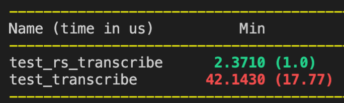
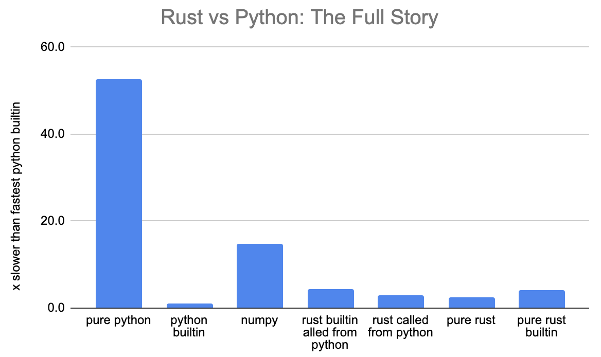

https://docs.google.com/spreadsheets/d/1-lrlYnfcRzlyVbfqHlM74Bpidv4auIxsR-fQR_o-oKo/edit#gid=0

# TODO:
pypy?
Python Rust capitalized

---------------

Five Levels of Bioinformatics Programming 
=========================================

# Level 1: Python

I've decided I want to make the switch from "data science" (whatever that means amirite?) to bioinformatics. I think a lot of my data skills will transfer over seamlessly to a new domain, but I've also been trying to learn more about biology by going through a list of I found on LinkedIn https://www.linkedin.com/pulse/how-learn-bioinformatics-4catalyzers-eric-jonathan-rothberg/ Rosalind [rosalind.info]. They are basically Euler https://projecteuler.net/archives problems with a biology focus. I started out solving them in Python, the language I know best.


Let's solve the second Rosalind problem: http://rosalind.info/problems/rna/ where we transcribe DNA to RNA. This is a one liner in Python:

``` python
def transcribe_dna_to_rna(s: str) -> str:
    return ''.join(["U" if char == 'T' else char for char in s])
```

# Level 2: Rust

I realized such problems would be a perfect opportunity to try out Rust to see if I can get some nice speed boosts without too much hassle. That's what Rust is supposed to be about. 


### If you already know about rust, skip this

Rust is a "low-level language with high-level abstractions". It's supposed to be as fast and fine grained as C, but more "erognomic" (less code to write because of the said high level abstractions) and also much safer.

A key difference is Rust is not garbage collected. Instead the compiler helps you manually manage memory, and as such requires you, the programmer, to write some extra bookeeping annotations about which functions are using which variables ("ownership", "borrowing", and "lifetimes"). I've seen it called "semiautomatic memory management" (as opposed to C/C++ where you have to just know and remember how to manage memory). This is why people often complain about "fighting the compiler" with rust because it's always pointing out inconsistencies in your variable management (in addition to the type errors you get from normal compilers). That said, once something does compile you should have a memory safe, robust, and probably very fast program.

There are also other low level aspects of the language, for example there is not one `int` type but _eight_ depending if you want the integer to be signed and how many bits you want to represent it with.

The rust book into is very good resource for learning the language: https://doc.rust-lang.org/book/. I agree the language has a steep learning curve, though I've not really done low-level or systems programming before, so a lot of the effort for me was/is learning _that_. Overall I've found Rust is like bowling with the bumpers: can be maddening to be alwys bouncing back and forth down the lane but eventually I will knock some pins over, vs C++ where i'd immideately be in a gutter of weird memory issues.


### Rust Implementation

The Rust implementation is pretty similar to the Python one (especially since we used python type hints), except for the `&` borrow notation and the `.collect()` we have to explicity call on the iterator (more on iterators in another post).  

``` rust
#[pyfunction]
pub fn transcribe_dna_to_rna(dna_seq: &str) -> String {
    dna_seq
        .chars()
        .map(|x| if x == 'T' { 'U' } else { x })
        .collect()
}
```

Additionally I added the `#[pyfunction]` line which is a decorator-type thing for from the Pyo3 rust package https://github.com/PyO3/pyo3 which makes it really easy to use rust with python.  You more or less just add the prefix and can then call the rust function from python like so:

``` python
import bio_lib_string_rs

bio_lib_string_rs.transcribe_dna_to_rna(dna)
```

 This way we can test out the practicality of using rust incrementally to speed up part of a python project. Since the rust version is nicely callable from python, i can easily wrap them in pytest benchmarks for the following result:

 

 Yay! The Rust version is nearly 20x faster*. This isn't including the overhead of transforming the python dna string input to be usable by rust. For example if we rust a pure rust profile on the same data, read direcly by rust this time, the function runs over 50x faster.

 Now some of you pythonistas might be foaming at the mouth and swearing at your screen right now because the way I implemented `transcribe` wasn't pythonic. I did:

 ``` python
def transcribe_dna_to_rna(s: str) -> str:
    return ''.join(["U" if char == 'T' else char for char in s])
```

when I could have just done:

``` python
def transcribe_dna_to_rna_builtin(s: str) -> str:
    return s.replace("T", "U")
```

Sure, Rust is a lot faster if we compare apples to apples implementations of the same algo, but it's not quite fair in this case because you'd never use that algo. So lets compare the python builtin, and also the rust builtin:

``` rust
#[pyfunction]
pub fn transcribe_dna_to_rna_builtin(dna_seq: &str) -> String {
    dna_seq.replace("T", "U")
}
```

And also see if numpy is any faster:

``` python
import numpy as np

def transcribe_dna_to_rna_np(s: str) -> str:
    return str(np.char.replace(s, "T", "U"))  # type: ignore
```


The python builtin `.replace` function is actually the fastest by far, over twice as fast as my Rust function and the rust `.replace` builtin. 

This makes sense since python's `.replace` is actually just a highly optimized C function https://github.com/python/cpython/blob/main/Objects/stringlib/replace.h (plus cpython is compiled with gcc, which can emit faster instructions than rust's LLVM https://news.ycombinator.com/item?id=20944403). 

on large data why is pure rust slower than python call?


# Appendix

- Optimized vs unoptimized rust:
transcribe:


- Installing and using pyo3, maturin papercuts using their instructions
	- needed to add a mysterious config to get it to compile on mac: https://stackoverflow.com/questions/28124221/error-linking-with-cc-failed-exit-code-1
	- Vscode rust-analyzer has some bugs that show errors in the py03 macros that aren't real: https://github.com/rust-analyzer/rust-analyzer/issues/6716, https://stackoverflow.com/questions/65223576/what-does-the-rust-analyzer-error-could-not-resolve-macro-crateformat-args
- test post-processing interop with python. For example, if all the iters are using enums and stuff, will that work with python?
- ?is transcribe right?
- ?numpy?
- ?dask?
- read, transcribe, translate
- different rust sub projects?

# 
- With py03 installed the project become pretty slow to compile ~22s (a known problem with rust).
- First test rust is about 30% _slower_! Maybe there's just some overhead, so let's make the file really big? Nope still 
- Try rust only: 
```
   Compiling bio-lib-string-rs v0.1.0 (/Users/luke/projects/rosalind/bio-lib-string-rs)
    Finished bench [optimized] target(s) in 1.40s
     Running unittests (target/release/deps/bio_lib_string_rs-4a9d6b8de2b2b531)


running 1 test
test tests::bench_trascribe_dna_to_rna ... bench: 716,362,489 ns/iter (+/- 66,738,448)

test tests::bench_convert_native ... bench: 1,024,635,980 ns/iter (+/- 29,729,272)

test result: ok. 0 passed; 0 failed; 0 ignored; 2 measured; 4 filtered out;

```
Hmm, according to this benchmark, traslating the entire file takes only ~.72 seconds. There must be something slow about translating the data back and forth to Python. Howver benchmarked Rust code is optimized (as you can see from the compiler message), while the imported lib is debug (less highly optimized).

This is a lesson: only optimize operations more complex per unit data than the translation process of moving the data back and forth between python and rust. In this case, it's not worth it: the incremental overhead of moving the data to rust and back is less than the incremental saving of doing the processing in rust. 

To test this out, lets make the operation we want to do more complex. Still o(n) but with a bigger constant. We'll now do this rosalind problem. Something >o(n) would be interesting, but I'm interested in constant time opererations as well, because one of the slower things in python is doing a custom .apply to a series of data (which is usually some constant time operation given a fixed window of data) and maybe rust would be useful for writing a fast drop in?

not implenenting in rust is actually pretty similar to python in this case, only the mandator types in the function defs but the rest are inferred. (Note I wanted to try out pythons 3.10s nice new pattern matching, but I could not install some of my dependencies and it seems still unstable, so I had to go back to 3.9) We use structs in rust and dataclasses in python, because using tuples + comments telling you what the two numbers inside are is obviously worse.


https://developers.redhat.com/blog/2017/11/16/speed-python-using-rust#python_with_itertools


# rust enums
- note all the function names have types encoded in them
- https://www.youtube.com/watch?v=FnBPECrSC7o&ab_channel=JaneStreet
- enum are a bit tricky because they aren't types
- Amino acid matching example (completeness and adding novel AAs, vs string code)
- sort of exist in python but without the key piece of support: pattern matching
   https://stackoverflow.com/questions/16258553/how-can-i-define-algebraic-data-types-in-python

# rust iters
- They are fast, and should be even faster when chaining (like spark)
- https://github.com/mike-barber/rust-zero-cost-abstractions/blob/main/README.md
- The rust compiler error messages are often very good. First they tend to nicely try to point out where you went wrong by highlighing the code (I think python has finally decided this is a good idea too new pep?). Second, they tend to anticipate why every errors occured and offer possible solutions. For example mispelling. That said it's not always nice. For example chaining methods sometiems led to me attempting to return a local variable. 
- I stuggled a lot to get them to work. I basically ran into every problem listed in this post. https://depth-first.com/articles/2020/06/22/returning-rust-iterators/ With the sort of root cause that ?statically dispatched traits? can't quite be used like types (and I wanted to avoid dynamic dispatch if possible (though maybe it wasn't necessary?))
- ? is there an example optimiztion that might happen?
- at least demonstrate the power of `take` etc.

# rust par_iter
https://medium.com/@mjschillawski/quick-and-easy-parallelization-in-python-32cb9027e490


https://crates.io/crates/multiversion