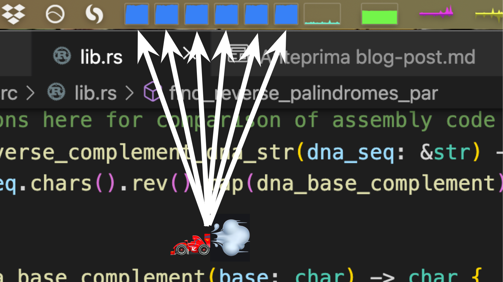
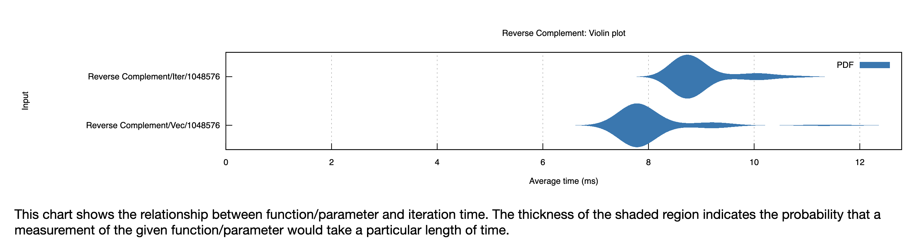

Five Levels of (Bioinformatics) Programming
=========================================

I wrote some code to do simple bioinformatics tasks and took it through five levels of improvement.

# Level 1: Python

I want to make the switch from "data science" to bioinformatics. Most of my statistics and machine learning skills will transfer seamlessly to this new domain, but I've also been learning more bioinformatics by doing [Rosalind problems](rosalind.info). Rosalind is like [Project Euler](https://projecteuler.net/archives) with a biology focus. I started out solving the problems in Python, the language I know best.

For example, in the second Rosalind [problem](http://rosalind.info/problems/rna/) we're asked to write a function that transcribes DNA to RNA:[^3]:

``` python
# python hand-rolled
def transcribe(dna: str) -> str:
    return ''.join(["U" if char == 'T' else char for char in dna])
```

# Level 2: Rust

I realized this would be a perfect opportunity to try out [Rust](https://www.rust-lang.org/), which is supposed to make writing extremely fast code safer and easier. 


### If You Already Know What Rust Is, Skip This

Rust is a "low-level language with high-level abstractions." It's supposed to be as fast and as fine-grained as C, but more "ergonomic" (less code to write because of the said high-level abstractions) and also much safer from bugs.

Rust is fast partially because it's not garbage collected. Instead, the compiler helps you manually manage memory. To this end it requires you, the programmer, to write some extra bookkeeping annotations that say which functions are using which variables and when (so-called "ownership" with "borrowing" and "lifetimes"). I've seen this called "semiautomatic memory management" (as opposed to C/C++ which are fully manual; the compiler doesn't stop you from making mistakes). This is why people often complain about "fighting the compiler" with Rust: it's always pointing out inconsistencies in your variable management (in addition to all the usual type errors you get from more typical compilers). That said, once something does compile, you should have a memory-safe, robust, and probably very fast program.

There are also other low-level complexities of the language. For example, there is not one `int` type but _eight_, depending on if you want the integer to be signed and how many bits you want to represent it with. You have to understand the basics of stack versus heap memory. Strings are [very complicated](https://fasterthanli.me/articles/working-with-strings-in-rust). And so on.

The [Rust book](https://doc.rust-lang.org/book/) is a great resource for learning the language. Rust has a steep learning curve, but I've also not really done low-level programming before, so a lot of the effort for me was learning _that_. Overall I've found Rust is like bowling with the bumpers: it can be maddening to be always bouncing back and forth down the lane, but eventually I always knock some pins over, as opposed to C++ where I'd probably never trust my code to run in a production environment, especially one as correctness-critical as biology. 


## Rust `.transcribe` 

The Rust implementation of `.transcribe` is pretty similar to the Python one (especially since I used Python type hints), except for the `&` borrow notation and the `.collect` one has to explicitly call on the lazily evaluated `.chars` iterator.  

``` rust
// rust hand-rolled
#[pyfunction]
fn transcribe(dna: &str) -> String {
    dna
        .chars()
        .map(|x| if x == 'T' { 'U' } else { x })
        .collect()
}
```

Additionally, I added the decorator-looking `#[pyfunction]` thing (actually a Rust macro) from the [PyO3 Rust package](https://github.com/PyO3/pyo3) which makes it really easy to use Rust with Python[^7].  You (more or less) just add such a prefix, and then you can call the Rust function from Python like so:

``` python
# calling rust functions from python
import bio_lib_string_rs

dna = "ACTGACTC"
bio_lib_string_rs.transcribe(dna)
```
Since the Rust version is callable from Python, I easily wrapped both implementations in [pytest benchmarks](https://github.com/cyniphile/rosalind/blob/main/tests/test_benchmark.py). For the initial test I used a small DNA file of ~1000bp and got the following result:


Woot. The Rust version is nearly 20x faster[^1], including the overhead of parsing the Python DNA string into a Rust string. I also ran a [pure Rust benchmark on the same data](https://github.com/cyniphile/rosalind/blob/04885c9644e1cff2287a43dce94763e80f482c39/bio-lib-string-rs/src/lib.rs#L195) (no Python involved) and Rust was over 50x faster than Python.

## More Thorough Performance Comparisons

Now some of you Pythonistas might be foaming at the mouth and swearing at your screen right now because the way I implemented `transcribe` wasn't very Pythonic. I hand-rolled the following function:

 ``` python
# python hand-rolled 
def transcribe(dna: str) -> str:
    return ''.join(["U" if char == 'T' else char for char in dna])
```

when I could have just used Python's built-in `.replace` function:

``` python
# python built-in
def transcribe_builtin(dna: str) -> str:
    return dna.replace("T", "U")
```

Sure, Rust is a lot faster if we compare apples-to-apples implementations of the same algorithm, but that's not quite fair in this case because you'd never actually use the hand-rolled implementation in Python, or even Rust for that matter (which also has a built-in `.replace`). So I [benchmarked the built-ins](https://github.com/cyniphile/rosalind/blob/main/tests/test_benchmark.py) as well: 

``` rust
// rust built-in
#[pyfunction]
fn transcribe_builtin(dna: &str) -> String {
    dna.replace("T", "U")
}
```

And also the Python `numpy` package built-in:


``` python
# numpy 
import numpy as np

def transcribe_np(dna: str) -> str:
    return str(np.char.replace(dna, "T", "U"))  # type: ignore
```
I also set up some [separate benchmarks](https://github.com/cyniphile/rosalind/blob/f8f0c3b89a34f269cdbce05e74fed93c198ace35/bio-lib-string-rs/src/lib.rs#L213) of the Rust functions called directly in Rust, no Python or PyO3 involved. Here are the results on the 1kbp file:


The Python built-in `.replace` function is actually the fastest by far. It's over twice as fast as my Rust function and the Rust `.replace` built-in. 

This sort of makes sense since Python's `.replace` is actually just [a highly optimized C function](https://github.com/python/cpython/blob/5f9247e36a0213b0dcfd43533db5cf6570895cfd/Objects/stringlib/transmogrify.h#L678), though it's still surprising that the Rust `.replace` built-in is a lot slower[^2]. 

The same ranking holds true over different sizes of data, though numpy seems to eventually overcome some fixed initialization overhead. 

This plot was made using a [`perfplot`](https://github.com/nschloe/perfplot)-based Python script, so the pure Rust functions weren't included.

## Actually Speeding Something Up

I decided to try out a more domain-specific bioinformatics task that isn't already a Python built-in. This next Rosalind problem is to [identify reverse palindromes](http://rosalind.info/problems/revp/) in a DNA sequence, Python answer below[^6]:

``` python
@dataclass
class PalindromeLocation:
    start_index: int
    length: int


def find_reverse_palindromes(seq: str) -> List[PalindromeLocation]:
    min_len = 4
    max_len = 12
    locations = []
    for i in range(0, len(seq) - min_len + 1):
        for length in range(min_len, max_len + 1, 2):
            if i + length > len(seq):
                continue
            test_seq = seq[i:(i + length)]
            if is_reverse_palindrome(test_seq):
                locations.append(
                    PalindromeLocation(start_index=i + 1, length=length)
                )
    return locations


def is_reverse_palindrome(seq: str) -> bool:
    return seq == reverse_complement_dna(seq)


def reverse_complement_dna(dna_seq: str) -> str:
    return ''.join([dna_base_complement(b) for b in dna_seq[::-1]])


def dna_base_complement(base: str) -> str: 
    if base == "A":
        return "T"
    elif base == "T":
        return "A"
    elif base == "G":
        return "C"
    elif base == "C":
        return "G"
    else:
        raise Exception("Non-DNA base \"{}\" found.".format(base))
```

The Rust implementation is very similar but uses a slightly more functional style (`.fold` instead of an outer `for` loop)[^5].  

``` rust
#[pyclass]
pub struct PalindromeLocation {
    #[pyo3(get, set)]
    pub start_index: usize,
    #[pyo3(get, set)]
    pub length: usize,
}

#[pyfunction]
pub fn find_reverse_palindromes(seq: &str) -> Vec<PalindromeLocation> {
    let min_len = 4;
    let max_len = 12;
    seq.chars()
        .take(seq.len() - min_len + 1)
        .enumerate()
        .fold(Vec::new(), |mut acc, (i, _)| {
            for length in (min_len..(max_len + 1)).step_by(2) {
                if i + length > seq.len() {
                    continue;
                }
                let test_seq = &seq[i..(i + length)];
                if is_reverse_palindrome(test_seq) {
                    acc.push(PalindromeLocation {
                        start_index: i + 1,
                        length,
                    });
                }
            }
            acc
        })
}

pub fn is_reverse_palindrome(seq: &str) -> bool {
    seq == reverse_complement_dna(seq)
}

pub fn reverse_complement_dna(dna_seq: &str) -> String {
    dna_seq.chars().rev().map(dna_base_complement).collect()
}

pub fn dna_base_complement(base: char) -> char {
    match base {
        'A' => 'T',
        'T' => 'A',
        'G' => 'C',
        'C' => 'G',
        _ => panic!("Non-DNA base \"{}\" found.", base),
    }
}
```

And I also added a small Python wrapper to map the Rust `PalindromeLocation` `struct` to the Python `dataclass`, which adds some more language interface overhead[^8].

``` python
def find_reverse_palindromes_rs(seq: str) -> List[PalindromeLocation]:
    ps = bio_lib_string_rs.find_reverse_palindromes(seq)
    return [ 
        PalindromeLocation(
            start_index=p.start_index,
            length=p.length
        )
        for p in ps 
    ]
```

I also made a Python implementation that uses Numpy arrays [(see the repo for details)](https://github.com/cyniphile/rosalind/blob/04885c9644e1cff2287a43dce94763e80f482c39/bio-lib-py/bio_lib_py/bio_lib.py#L82).

How did things pan out this time?

skk

Rust is about 15x faster than base Python, even with all the conversion overhead! Was it worth the effort? I'd say "yes!" Writing these relatively simple Rust functions is frankly pretty easy (though Rust definitely can get a lot harder). The PyO3 crate makes it pretty straightforward to incrementally add the extra "Rust thrust" (new viral hashtag?) when you need it. This wasn't without paper-cuts or head-scratchers, but if this was for heavily reused code (perhaps part of some data pipeline), it's well worth the price of implementation.[^4] 


# Level 3: Algebraic Data Types

So far I've just represented DNA as strings. This is bad, and here's an example of why. 

``` rust
pub fn dna_base_complement(base: char) -> char {
    match base {
        'A' => 'T',
        'T' => 'A',
        'G' => 'C',
        'C' => 'G',
        // Commented out for now...
        // _ => panic!("Non-DNA base \"{}\" found.", base),
    }
}
```

This Rust little function, when given a DNA base, returns the complementary base. Note I had to name it `dna_base_complement`, because it only works with DNA. If you understand basic biology, you know the output is also DNA (not RNA, or amino acids). However, none of this information is encoded in the logic of the function's code.

I've commented out a line in the code above, and without it, the function actually doesn't compile. Rust checks pattern matches for exhaustivity, and since _any_ UTF-8 `char` can be passed in to this function, I have to also handle the case where the `base` argument happens to not be "A", "C", "T", or "G". 


So I have to uncomment that last line, which is a catch-all case. Now if I somehow give a non-DNA character to our function at runtime, the program will panic (and crash if the panic isn't handled). Say I accidentally pass in the RNA character "U"...uh oh! 

Using Rust's type system I can completely eliminate the possibility of this kind of error. Specifically, I made use of *Algebraic Data Types* or ADTs.

Algebraic data types are simply types composed of other types. There are two main kinds of ADTs: product types and sum types. A product type is an AND group of types: for example tuples, `struct`s, or Python `dataclass`es. These are pretty obviously useful: sometimes you need to group diversely typed data together under one type, like a `user` type that has  string `name` AND integer `age` fields. 

The other common ADT, the sum type, was new to me, but I've realized it's perhaps even more powerful and interesting[^9]. A sum type is an XOR group of different types, so an instance can be one (and only one) type out of a set of given options. In Rust you create sum types with the `enum` keyword. For example:

``` rust
pub enum DnaNucleotide {
    A,
    C,
    G,
    T,
}
```

This defines `DnaNucleotide` as a new type that can be one of four variants[^10] `A`, `C`, `G`, or `T`. Why is this interesting? Well, now I can rewrite my `complement` function like so:

``` rust
fn complement(base: DnaNucleotide) -> DnaNucleotide {
    match base {
          DnaNucleotide::A => DnaNucleotide::T,
          DnaNucleotide::T => DnaNucleotide::A,
          DnaNucleotide::C => DnaNucleotide::G,
          DnaNucleotide::G => DnaNucleotide::C,
    }
}
```

Note I dropped the `dna_` prefix from the function name: I know I are getting the complement of DNA because the `base` argument is of `DnaNucleotide` type, and so is the return type. It only accepts DNA, not RNA or "!" or "为" or "🌯". And if I try to pass in a character I get a _compile time_ error:


We aren't even allowed to wire `complement` up to anything but its proper DNA input. We also get another neat exhaustivity check at compile time if I forget to handle one of the enumerated bases:


This time I don't have to add the catch-all `_ => panic!("Non-DNA base \"{}\" found.", base)` case because the compiler knows there can only be 4 different `DnaNucleotide` variants, and I've properly handled all of them. While this example might seem trivial, what about, say, a function from codons to amino acids? If I forget or duplicate one of the $4^3$ codons (like I did below), the compiler tells us!


Note in this example I've made use of `RnaNucleotide` and `AminoAcid` enums that I defined [elsewhere in the code](https://github.com/cyniphile/rosalind/blob/main/bio-lib-algebraic-rs/src/lib.rs). 

This is useful for easily adapting the software to work in [alloproteins](https://en.wikipedia.org/wiki/Alloprotein#:~:text=An%20alloprotein%20is%20a%20novel,non%2Dnatural%22%20amino%20acids.&text=The%20usual%20mechanisms%2C%20which%20produce,novel%20proteins%20the%20same%20way.) (proteins with non-natural amino acids) or [artificial base pairs](https://en.wikipedia.org/wiki/D5SICS). All I'd have to do is add another symbol to the "AminoAcid" or "DnaNucleotide" enums, and then a bunch of exhaustivity checking compiler errors will pop up wherever I now need to handle the new variant type. 

## Speed

Does all this organizational overhead make our code perform less efficiently? Well, theoretically it could actually make it more efficient. Strings (in both Rust and Python) are encoded in UTF-8 which uses a minimum of 8-bits per symbol. DNA has only four symbols and so only really needs 2 bits. Another consideration is parsing: if our DNA is saved in a file (say [FASTA format](https://en.wikipedia.org/wiki/FASTA_format) which just uses character strings), we have to read the file _and_ parse it into our internal enum representation. This means [more code to write](https://github.com/cyniphile/rosalind/blob/99c3fdb60985b09e9418b308d9bdae4a7657ecbe/bio-lib-algebraic-rs/src/lib.rs#L86) and more computational overhead.

I wasn't sure how the trade-off would play out, so I just benchmarked everything using the excellent [`criterion`](https://github.com/bheisler/criterion.rs) package for Rust. I compared the original string `find_reverse_palindromes` function with one that operates on a vector of `DnaNucleotide` enums. I also timed the ADT/enum version both including the string-to-enum parsing step, and a pre-parsed version where I only timed the palindrome searching part. Drumroll... 


It looks like Rust's promise of "zero-cost abstractions" is is a lie, we are actually getting _negative_ cost abstractions here! Even including the parsing overhead, the ADT-based version of our function is over twice as fast as the string version. The Rust compiler clearly takes advantage of the `enum` representation to make some key optimizations (though I couldn't tell what these optimizations actually are when comparing the [emitted assembly and LLVM IR](https://github.com/cyniphile/rosalind/blob/main/bio-lib-algebraic-rs/asm_output/find_reverse_palindromes_adt.asm) of the two functions. I leave that as an exercise for the reader 😃). 

## What About Python?

ADTs sort-of [exist in Python](https://stackoverflow.com/questions/16258553/how-can-i-define-algebraic-data-types-in-python) while using `mypy` typechecking, which even offers hacky-feeling [exhaustivity checks](https://hakibenita.com/python-mypy-exhaustive-checking). However, Enum support is [not quite ready in PyO3](https://github.com/PyO3/pyo3/issues/834), so it's not yet possible to call enum-based Rust functions from Python. To use Rust in Python, we'll just have to wrap our ADT-style function with one that accepts a string and pre-parses it into a vector of enums:

```rust
#[pyfunction]
pub fn find_reverse_palindrome_dna(seq: &str) -> Vec<PalindromeLocation> {
    let seq = DNA::parse_string(seq);
    find_reverse_palindromes(&seq)
}
```
While this hack unfortunately sequesters all the nice ADT-related type checks to the Rust side of the code, at least it allows us to take advantage of the speed boost of using enums in Python. 

# Level 4: Parallel 

So far I've been ignoring one of the most important speed factors in modern programming: parallelism. It's always slightly painful to see my six-core Intel i7 running at, well, 1/6 capacity!

I decided to try out the newish [ray](https://github.com/ray-project/ray) package to parallelize my Python code. I ran into some gotchas, but the [tutorials](https://docs.ray.io/en/latest/ray-design-patterns/fine-grained-tasks.html) were generally helpful. The code for finding reverse palindromes ended up being reasonably similar to the single-threaded version , though it requires an extra parameter `BATCH_SIZE` which needs be tuned to optimally slice up work into chunks:

``` python
import ray
import functools
import operator


def find_reverse_palindromes_par(seq: str) -> List[PalindromeLocation]:
    min_len = 4
    max_len = 12
    locations = []
    ray_seq = ray.put(seq)  # type: ignore
    BATCH_SIZE = 100

    @ray.remote  # type: ignore
    def is_palindrome(i: int) -> List[PalindromeLocation]:
        seq = ray.get(ray_seq)  # type: ignore
        locations_inner = []
        for i in range(i, i+BATCH_SIZE):
            for length in range(min_len, max_len + 1, 2):
                if i + length > len(seq):  # type: ignore
                    continue
                test_seq = seq[i:(i + length)]  # type: ignore
                if is_reverse_palindrome(test_seq):  # type: ignore
                    locations_inner.append(
                        PalindromeLocation(start_index=i + 1, length=length)
                    )
        return locations_inner

    for i in range(0, len(seq) - min_len + 1, BATCH_SIZE):
        locations.append(is_palindrome.remote(i))
    return functools.reduce( # flatten list of list
        operator.iconcat, ray.get(locations), []  # type: ignore
    )
```
Now let's run this and take a look at our CPU monitor:


Yeah baby! All six cores fully engaged sir!

Parallelizing the Rust code turned out to be the first case where implementation is actually easier in Rust than Python thanks to the excellent [`rayon`](https://github.com/rayon-rs/rayon) package:

```rust
pub fn find_reverse_palindromes_par(seq: &DNASlice) -> Vec<PalindromeLocation> {
    let min_len = 4;
    let max_len = 12;
    seq.into_par_iter()
        .take(seq.len() - min_len + 1)
        .enumerate()
        .fold(Vec::new, |mut acc, (i, _)| {
            for length in (min_len..(max_len + 1)).step_by(2) {
                if i + length > seq.len() {
                    continue;
                }
                let test_seq = &seq[i..(i + length)];
                if is_reverse_palindrome(test_seq) {
                    acc.push(PalindromeLocation {
                        start_index: i + 1,
                        length,
                    });
                }
            }
            acc
        })
        .reduce(
            Vec::new,
            |a: Vec<PalindromeLocation>, b: Vec<PalindromeLocation>| [a, b].concat(),
        )
}
```

It's as simple as changing `.iter` to `.into_par_iter` and adding a `reduce` function at the end to stitch together all the asynchronously returned results. Of course, it also needed to be wrapped in similar Python->string->enum/ADT wrapper functions to be useable from Python.

So now it's time for the final showdown. How do all these "levels" compare speed-wise?


Remember these results are all calls from Python. 

While both parallel implementations are slower for smaller inputs (as expected), the Python version is _much_ slower, and it eventually returns to being slower than sequential Python. This was because the `BATCH_SIZE` parameter needed some tuning, and after some tedious brute force experimentation, I found a slightly better value. However Rust's `rayon` performed excellently out of the box thanks to it's built-in dynamic performance tuning.  

It's neat to see the performance gains for each of our "levels" of code improvement. In the end, I made my code safer, better organized, _and_ faster by nearly two orders of magnitude. The overhead of learning Rust is certainly high, but hey, I'm already over that hump! 


# Level 5?

So as not to fall into publication bias, I also tried a "level 5" version of this code by using iterators more heavily. But...well, gather round...

I was discussing this project with a hacker friend who suggested modifying my functions to return iterators instead of vectors. This way, I could chain together various transformation functions lazily and only call `.collect` when needed. The compiler could than optimize the entire chain of transformations top to bottom instead of being forced to return a vector at each step. Since I'm a data scientist with a Spark background, this suggestion made a lot of sense. 

This is where implementing things in Rust got incredibly tricky, and frankly very unproductive. I had to switch over to Rust's nightly build to be able to make use of experimental typing features. I had to rewrite one line functions as 25-line home-made iterator implementations. I had to really get in the mud with lifetimes, traits, and generics, leading to function signatures like:

```rust
pub fn transcribe<'a>(seq: DnaIter<'a>) -> impl Iterator<Item = RnaNucleotide> + 'a
where
    DnaIter<'a>: 'a,
{
    seq.map(|b| transcribe_base(&b))
}
```

In the end, my code was much _less_ clean, though I could have possibly made it cleaner by using performance-sapping dynamic dispatch[^11].

I should have stopped and benchmarked sooner, but instead I struggled to port the entire set of bioinformatics functions I'd written so far to this iterators based implementation. [The entire monstrosity is available here](https://github.com/cyniphile/rosalind/blob/main/bio-lib-rs/src/lib.rs). And yes, in the end, the code was significantly (~10%) slower. See one benchmark below: 



It would have needed to be a lot faster to justify all the extra work and codebase messiness. Given it was pretty hard to find examples of people using this iterator pattern online, I'm guessing it's pretty much an anti-pattern. The Rust compiler is clearly worse at optimizing code written this way. In the Rust community, there's a lot of talk about "idiomatic" code, and I see the value. Unless you're fluent in assembly and compilers (I'm not), just writing Rust idiomatically seems like an important heuristic for also getting performant Rust. In this case, I violated a universal idiom of all programming languages: "if you're writing lots of complicated code to do simple things, you're probably doing it wrong."

Anyway, I guess 4 levels of improvement was enough...


# TL;DR

- Rust is faster than Python, but not for very simple things. 
- It's pretty easy to call fast Rust functions from Python.
- Use algebraic data types, especially sum types. ADT-based code is cleaner, safer, and faster.
- Parallelization is important, and it's easy(er) to do in Rust.
- Benchmark, don't theorize. As is written in the `cargo-flamegraph` readme: ["Humans are terrible at guessing about performance!"](https://github.com/flamegraph-rs/flamegraph#humans-are-terrible-at-guessing-about-performance)
- Writing Rust simply and idiomatically will probably make the fastest code (as well as the cleanest).


# Notes 
[^3]: DNA sequence data are stored as the coding strand (not the template strand), so "transcription" really does mean "replace T with U" not "find the RNA complement strand"

[^7]: For a more detailed tutorial [see this guide](https://depth-first.com/articles/2020/08/10/python-extensions-in-pure-rust-with-pyo3/). Installing and using PyO3 had some paper-cuts: 
	- I needed to add [a mysterious config](https://stackoverflow.com/questions/28124221/error-linking-with-cc-failed-exit-code-1) to get it to compile on Mac: 
	- The VSCode [rust-analyzer](https://marketplace.visualstudio.com/items?itemName=matklad.rust-analyzer) has a bug where it [shows](https://github.com/rust-analyzer/rust-analyzer/issues/6716) fake [errors](https://stackoverflow.com/questions/65223576/what-does-the-rust-analyzer-error-could-not-resolve-macro-crateformat-args) in PyO3 macros.  
	-  With PyO3 installed, my project began to show some of Rust's infamous slow compile times (it went from a couple of seconds ~22s).

[^1]: It's important to use the super-optimized (and slow compiling) `--release` flag here. Otherwise, Rust compiles using the default fast-compiling/slow-performing `--debug` setting. Check out the performance difference for the `transcribe` function: 


[^2]: Perhaps this is because CPython is compiled with gcc, [which can sometimes emit faster instructions than Rust's LLVM-based compiler](https://news.ycombinator.com/item?id=20944403). Or perhaps something else; I didn't look into it too closely.

[^8]: We could define the Python `dataclass [purely in Rust](https://depth-first.com/articles/2020/08/10/python-extensions-in-pure-rust-with-pyo3/), but I wanted to simulate the effect of adding Rust to an existing Python project, where maybe you don't want to move a class definition to Rust. 

[^6]: Yes, I know, this is not the best algorithm. That's not the point. The point is to compare the same algorithm in Rust and Python. Side note: I wanted to try out Python 3.10's new [pattern matching](https://www.python.org/dev/peps/pep-0636/), but I couldn't install some dependencies (SciPy), so I had to go back to version 3.9.

[^5]: This was the first time I ran into not-so-nice problems with PyO3. I started with a Rust implementation [nearly identical to the Python one](https://github.com/cyniphile/rosalind/blob/04885c9644e1cff2287a43dce94763e80f482c39/bio-lib-string-rs/src/lib.rs#L139) but I ran into a weird GIL deadlock when benchmarking with `perfplot` (which apparently does some multithreaded stuff). I managed to resolve this by not having any `mut` or borrowed variables in the function body, but this was a quick hack fix. I have not yet gone deep on the [GIL and mutability](https://pyo3.rs/v0.15.0/types.html?highlight=gil#gil-lifetimes-mutability-and-python-object-types) w.r.t. PyO3.

[^4]: Btw, what about PyPy? I didn't try it because it still just [don't seem ready](https://scikit-learn.org/stable/faq.html#do-you-support-pypy) as a viable CPython alternative for data science.

[^9]: [This talk](https://youtu.be/FnBPECrSC7o?t=1867) by Ron Minsky of Jane Street Capital has some really interesting examples of using algebraic data types to write more robust code (using OCaml in the context of securities trading).

[^10]: In Rust, variants of an enum aren't actually types, so you can't so something like `fn f(s: DnaNucleotide::A) {}`. You also can't write polymorphic code with enums like so:
    ```rust
    enum Nucleotide{
        RnaNucleotide,
        DnaNucleotide,
    }

    fn foo(s: Nucleotide) {s.complement();}
    ```
    even if all the variants in the enum implement a `.complement` method. Instead you have to do [some wrapper/destructuring stuff](https://stackoverflow.com/questions/51188460/how-can-i-structure-destructure-an-enum-of-enums) (which is pretty messy) or you have to use [trait bounds](https://doc.rust-lang.org/rust-by-example/generics/bounds.html) like so: 
    ``` rust
    pub trait Nucleotide {
        fn complement(&self) -> Self;
    }

    fn foo(s: impl Nucleotide) {s.complement();}
    ```

[^11]:  I ran into basically every problem listed in [this post](https://depth-first.com/articles/2020/06/22/returning-rust-iterators/).
 