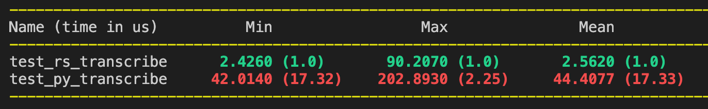
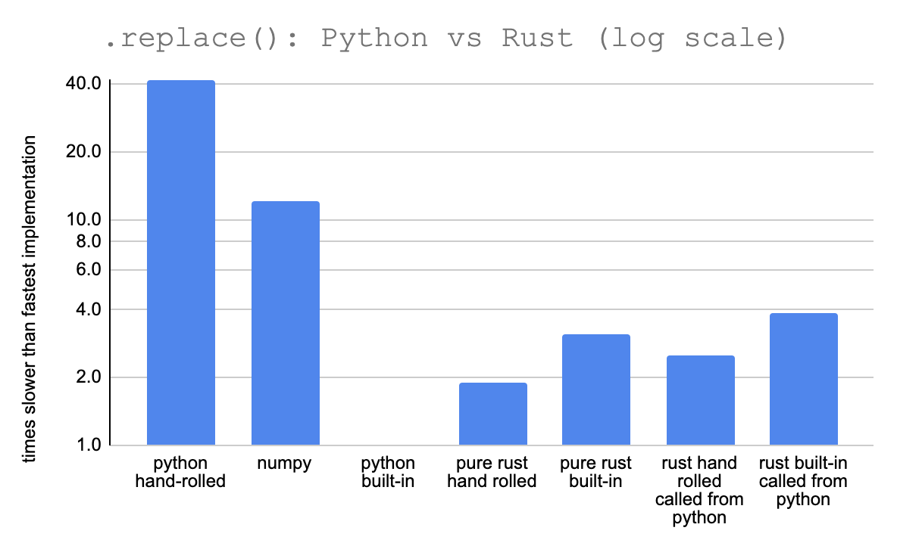
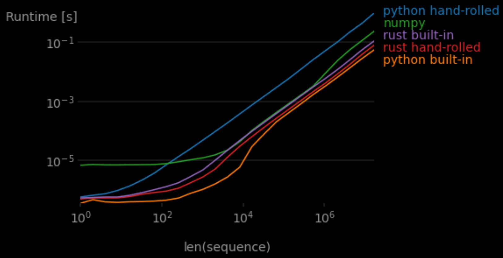
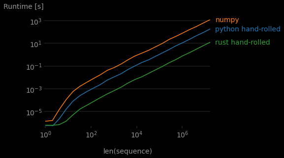
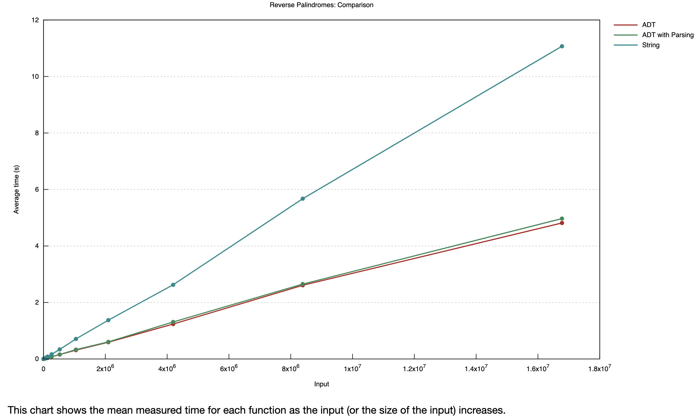
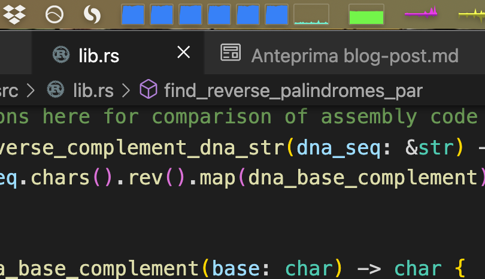
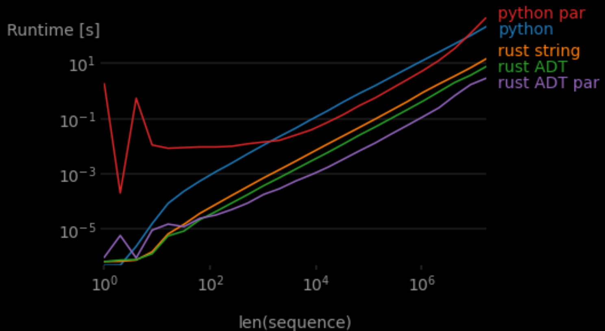
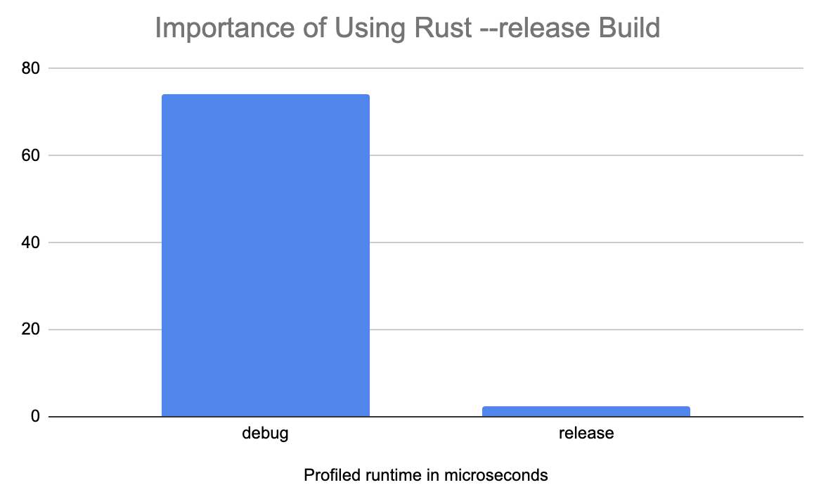

Four Levels of (Bioinformatics) Programming
=========================================

# Level 1: Python

I've decided I want to make the switch from "data science" (whatever that means amirite?) to bioinformatics. A lot of my statistics, and ML skills will transfer over seamlessly to this new domain, but I've also been learning more about bioinformatics by going through a [list of steps I found on LinkedIn](https://www.linkedin.com/pulse/how-learn-bioinformatics-4catalyzers-eric-jonathan-rothberg/) and doing [Rosalind problems](rosalind.info). Rosalind is basically the [Project Euler](https://projecteuler.net/archives) with a biology focus. I started out solving the problems in Python, the language I know best.

For example, in the second Rosalind [problem](http://rosalind.info/problems/rna/) we transcribe[^3] DNA to RNA. This is a one-liner in Python:

``` python
# python hand-rolled
def transcribe(dna: str) -> str:
    return ''.join(["U" if char == 'T' else char for char in dna])
```

# Level 2: Rust

I realized these would be a perfect opportunity to try out [Rust](https://www.rust-lang.org/) to see if I can get some nice speed boosts without too much hassle. That's what Rust is supposed to be about. 


### If You Already Know About Rust, Skip This

Rust is a "low-level language with high-level abstractions." It's supposed to be as fast and fine-grained as C, but more "ergonomic" (less code to write because of the said high-level abstractions) and also much safer from bugs.

Rust is not garbage collected. Instead, the compiler helps you manually manage memory and so requires you, the programmer, to write some extra bookkeeping annotations about which functions are using which variables ("ownership", "borrowing", and "lifetimes"). I've seen this called "semiautomatic memory management" (as opposed to C/C++ where you have to just know how to manage memory; the compiler doesn't stop you from making mistakes). This is why people often complain about "fighting the compiler" with Rust: it's always pointing out inconsistencies in your variable management (in addition to all the type errors you get from more typical compilers). That said, once something does compile, you should have a memory-safe, robust, and probably very fast program.

There are also other low-level aspects of the language. For example, there is not one `int` type but _eight_, depending if you want the integer to be signed and how many bits you want to represent it with.

The [Rust book](https://doc.rust-lang.org/book/) is a very good resource for learning the language. It has a steep learning curve, but I've also not really done low-level programming before, so a lot of the effort for me was learning _that_. Overall I've found Rust is like bowling with the bumpers: it can be maddening to be always bouncing back and forth down the lane, but eventually I will knock some pins over, vs C++ where I'd immediately be in a gutter of weird silent errors.


## Rust Implementation

The Rust implementation is pretty similar to the Python one (especially since we used Python type hints), except for the `&` borrow notation and the `.collect` we have to explicitly call on the `.chars` iterator (more on iterators in another post).  

``` rust
// rust hand rolled
#[pyfunction]
fn transcribe(dna: &str) -> String {
    dna
        .chars()
        .map(|x| if x == 'T' { 'U' } else { x })
        .collect()
}
```

Additionally, I added the decorator-looking `#[pyfunction]` thing (actually a Rust macro) from the [PyO3 Rust package](https://github.com/PyO3/pyo3) which makes it really easy to use Rust with Python[^7].  You (more or less) just add such a prefix and then call the Rust function from Python like so:

``` python
# calling rust functions from python
import bio_lib_string_rs

dna = "ACTGACTC"
bio_lib_string_rs.transcribe(dna)
```

This way we can test out the practicality of using Rust incrementally to speed up part of a Python project. Since the Rust version is nicely callable from Python, I can easily wrap them in [pytest benchmarks](https://github.com/cyniphile/rosalind/blob/main/tests/test_benchmark.py). For an initial test I used a small DNA file of ~1000 bp for the following result:


Woot. The Rust version is nearly 20x faster[^1], including the overhead of transforming the Python DNA string input to be usable by Rust. If we run a [pure Rust benchmark on the same data](https://github.com/cyniphile/rosalind/blob/04885c9644e1cff2287a43dce94763e80f482c39/bio-lib-string-rs/src/lib.rs#L195) (no Python involved) it jumps to 50x faster.

## More Thorough Performance Comparisons

Now some of you Pythonistas might be foaming at the mouth and swearing at your screen right now because the way I implemented `transcribe` wasn't very Pythonic. I hand-rolled the following function:

 ``` python
# python hand-rolled 
def transcribe(dna: str) -> str:
    return ''.join(["U" if char == 'T' else char for char in dna])
```

when I could have just used the built-in `.replace` function:

``` python
# python built-in
def transcribe_builtin(dna: str) -> str:
    return dna.replace("T", "U")
```

Sure, Rust is a lot faster if we compare apples-to-apples implementations of the same algorithm, but it's not quite fair in this case because you'd never actually use that such an algo in Python, or Rust (which also has a built-in `.replace`). So let's also [benchmark the built-ins](https://github.com/cyniphile/rosalind/blob/main/tests/test_benchmark.py) as well: 

``` rust
// rust built-in
#[pyfunction]
fn transcribe_builtin(dna: &str) -> String {
    dna.replace("T", "U")
}
```

And also the Python numpy package built-in:


``` python
# numpy 
import numpy as np

def transcribe_np(dna: str) -> str:
    return str(np.char.replace(dna, "T", "U"))  # type: ignore
```
I also set up some [separate benchmarks](https://github.com/cyniphile/rosalind/blob/f8f0c3b89a34f269cdbce05e74fed93c198ace35/bio-lib-string-rs/src/lib.rs#L213) of the Rust functions called directly in Rust, no Python of PyO3 involved. 


The python built-in `.replace` function is actually the fastest by far, over twice as fast as my Rust function and the Rust `.replace` built-in. 

This sort of makes sense since Python's `.replace` is actually just [a highly optimized C function](https://github.com/python/cpython/blob/5f9247e36a0213b0dcfd43533db5cf6570895cfd/Objects/stringlib/transmogrify.h#L678), though it's still surprising that the Rust `.replace` built-in is a lot slower[^2]. 

The same ranking holds true over different sizes of data, though numpy seems to eventually overcome some fixed initialization overhead. 

This chart (and subsequent such charts) were made using a [`perfplot`](https://github.com/nschloe/perfplot) Python script, so the pure Rust performance couldn't be included.

## Actually Speeding Something Up

Let's try out a more custom task that isn't already a Python built-in. This next Rosalind problem is to [identify reverse palindromes](http://rosalind.info/problems/revp/) in a DNA sequence.[^6] 

``` python
@dataclass
class PalindromeLocation:
    start_index: int
    length: int


def find_reverse_palindromes(seq: str) -> List[PalindromeLocation]:
    min_len = 4
    max_len = 12
    locations = []
    for i in range(0, len(seq) - min_len + 1):
        for length in range(min_len, max_len + 1, 2):
            if i + length > len(seq):
                continue
            test_seq = seq[i:(i + length)]
            if is_reverse_palindrome(test_seq):
                locations.append(
                    PalindromeLocation(start_index=i + 1, length=length)
                )
    return locations


def is_reverse_palindrome(seq: str) -> bool:
    return seq == reverse_complement_dna(seq)


def reverse_complement_dna(dna_seq: str) -> str:
    return ''.join([dna_base_complement(b) for b in dna_seq[::-1]])


def dna_base_complement(base: str) -> str: 
    if base == "A":
        return "T"
    elif base == "T":
        return "A"
    elif base == "G":
        return "C"
    elif base == "C":
        return "G"
    else:
        raise Exception("Non-DNA base \"{}\" found.".format(base))
```

The Rust implementation is very similar but uses a slightly more functional style (`.fold` instead of an outer `for` loop) [^5].  

``` rust
#[pyclass]
pub struct PalindromeLocation {
    #[pyo3(get, set)]
    pub start_index: usize,
    #[pyo3(get, set)]
    pub length: usize,
}

#[pyfunction]
pub fn find_reverse_palindromes(seq: &str) -> Vec<PalindromeLocation> {
    let min_len = 4;
    let max_len = 12;
    seq.chars()
        .take(seq.len() - min_len + 1)
        .enumerate()
        .fold(Vec::new(), |mut acc, (i, _)| {
            for length in (min_len..(max_len + 1)).step_by(2) {
                if i + length > seq.len() {
                    continue;
                }
                let test_seq = &seq[i..(i + length)];
                if is_reverse_palindrome(test_seq) {
                    acc.push(PalindromeLocation {
                        start_index: i + 1,
                        length,
                    });
                }
            }
            acc
        })
}

pub fn is_reverse_palindrome(seq: &str) -> bool {
    seq == reverse_complement_dna(seq)
}

pub fn reverse_complement_dna(dna_seq: &str) -> String {
    dna_seq.chars().rev().map(dna_base_complement).collect()
}

pub fn dna_base_complement(base: char) -> char {
    match base {
        'A' => 'T',
        'T' => 'A',
        'G' => 'C',
        'C' => 'G',
        _ => panic!("Non-DNA base \"{}\" found.", base),
    }
}
```

And I also added a small Python wrapper to map the Rust `PalindromeLocation` `struct` to the Python `dataclass`, which adds even more overhead[^8].

``` python
def find_reverse_palindromes_rs(seq: str) -> List[PalindromeLocation]:
    ps = bio_lib_string_rs.find_reverse_palindromes(seq)
    return [ 
        PalindromeLocation(
            start_index=p.start_index,
            length=p.length
        )
        for p in ps 
    ]
```

I also made a Python implementation that uses Numpy arrays [(see the repo for details)](https://github.com/cyniphile/rosalind/blob/04885c9644e1cff2287a43dce94763e80f482c39/bio-lib-py/bio_lib_py/bio_lib.py#L82).

How do things pan out this time?



Rust is about 15x faster than base Python, even with all the conversion overhead! Was it worth the effort? I'd say "yes!". Writing these relatively simple Rust functions is frankly pretty easy (Rust definitely gets harder! But that's for a later post). And the PyO3 crate makes it pretty straightforward to incrementally add the extra "Rust thrust" (new viral hashtag?) when you need it. This wasn't without papercuts or headscratchers (as detailed below in the notes), but if this was for heavily reused code (perhaps part of some data pipeline), I think it's well worth the price.[^4] 


# Level 3: Using Algebraic Types in Rust

So far we've just represented DNA as strings. This is bad, and here's an example of why. 

``` rust
pub fn dna_base_complement(base: char) -> char {
    match base {
        'A' => 'T',
        'T' => 'A',
        'G' => 'C',
        'C' => 'G',
        // Commented out for now...
        // _ => panic!("Non-DNA base \"{}\" found.", base),
    }
}
```

This little function, given DNA a base, returns the complentary base. Note I had to name it `dna_base_complement`, because it only works with DNA. And if you understand biology, you know the output is also DNA (not RNA, Amino acid). None of this important information is represented in the logic of the program.

This function actually doesn't compile as is. Rust checks pattern matches for exhaustivity, and since and UTF-8 `char` can be passed in to this function, we have to also handle the case where the `base` argument happens to not be "A", "C", "T", or "G". 


So we have to uncomment that last line, which adds a catch-all case. Now if we somehow give a non-DNA character to our function at runtime, the program will panic (and crash if the panic isn't unhandled). Say we accidentally pass in the RNA character "U"...uh oohh! 

Using Rust's type system we can eliminate the possibility of this kind of error. Specifically, we'll make use of _Algebraic Data Types_ or ADTs.

Algebraic data types are simply types composed of other types. There are two main kinds of ADTs: product types and sum types. A product types is an AND group of types: for example tuples, `struct`s, or Python dataclasses. These are pretty obviously useful: sometimes you need to group diversely typed data together into one type, like a `user` type that has a string `name` AND and integer `age`. 

The other common ADT, the sum type, was new to me, but I've realized it's perhaps even more powerful and interesting[^9]. A sum type is an XOR group of different types, so an instance can be one (and only one) type out of a set of given options. In Rust you create sum types with the `enum` keyword. For example:

``` rust
pub enum DnaNucleotide {
    A,
    C,
    G,
    T,
}
```

This defines `DnaNucleotide` as a new type that can be one of four variants[^10] `A`, `C`, `G`, or `T`. Why is this interesting? Well now we can rewrite our `complement` function like so:

``` rust
fn complement(base: DnaNucleotide) -> DnaNucleotide {
    match base {
          DnaNucleotide::A => DnaNucleotide::T,
          DnaNucleotide::T => DnaNucleotide::A,
          DnaNucleotide::C => DnaNucleotide::G,
          DnaNucleotide::G => DnaNucleotide::C,
    }
}
```

Note we droped the `dna_` prefix from the function name: we know we are getting the complement of DNA because the `base` argument is of `DnaNucleotide` type, and so is the return type. It only accepts DNA, not RNA or "!" or "为" or "🌯". And if we try to pass in a character we get a _compile time_ error:


We aren't even allowed to wire up `complement` to anything but its proper DNA input. We also get another neat exhaustivity check at compile time if we forget to handle one of the bases:


This time we don't have to add the catch-all `_ => panic!("Non-DNA base \"{}\" found.", base)` case because the compiler knows there can only be 4 different `DnaNucleotide` variants, and we've properly handled all of them.While this example might seem trivial, what about going from codons to amino acids? If we forget or duplicate one of the 3^4 codons, the compiler tells us!


Note in this example I've made use of both `RnaNucleotide` and `AminoAcid` enums I defined [elsewhere in the code](https://github.com/cyniphile/rosalind/blob/main/bio-lib-algebraic-rs/src/lib.rs). 

This is useful for adapting the software to cutting edge biology work in [alloproteins](https://en.wikipedia.org/wiki/Alloprotein#:~:text=An%20alloprotein%20is%20a%20novel,non%2Dnatural%22%20amino%20acids.&text=The%20usual%20mechanisms%2C%20which%20produce,novel%20proteins%20the%20same%20way.) (proteins with non-natural amino acids) or [artificial base pairs](https://en.wikipedia.org/wiki/D5SICS). All we have to do is add another symbol to the "AminoAcid" or "DnaNucleotide" enums, and then a bunch of exhaustivity checking compiler errors will pop up wherever we now need to handle the new variant type. 

## Speed

Does all this organizational overhead make our code perform less efficiently? Well, theoretically it could actually make it more efficient. Strings (in both Rust and Python), are encoded in UTF-8, which uses a minimum of 8-bits per symbol. DNA has only four symbols, and so only really needs 2 bits. Another consideration is parsing: if our DNA is saved in a file (say [FASTA format](https://en.wikipedia.org/wiki/FASTA_format), which just uses character strings), we have to read the file _and_ parse it into our internal enum representation (which means [more code to write](https://github.com/cyniphile/rosalind/blob/99c3fdb60985b09e9418b308d9bdae4a7657ecbe/bio-lib-algebraic-rs/src/lib.rs#L86) and more computational overhead).

To find out, we'll just benchmark everything using the excellent [criterion](https://github.com/bheisler/criterion.rs) package for Rust. We'll compare the original string `find_reverse_palindromes` function with a reverse palindromes function that operates on a vector of `DnaNucleotide` enums. We'll also time the ADT version including the string -> enum parsing step, and a pre-parsed version where we only time the palindrome searching part. 



It looiks like Rust's promise of "zero-cost abstractions" is is a lie, we are actually getting _negative_ cost abstractions here! Even including parsing overhead, the ADT version of our fuction is over twice as fast as the string version. The Rust compiler clearly takes advantage of the `enum` representation to make some key optimizations (though I couldn't really tell what these optimizations actually are when comparing the [emitted assembly and LLVM IR](https://github.com/cyniphile/rosalind/blob/main/bio-lib-algebraic-rs/asm_output/find_reverse_palindromes_adt.asm) of the two functions. I leave that as an excercise for the reader 😃). 

## What About Python?

ADTs sort-of [exist in Python](https://stackoverflow.com/questions/16258553/how-can-i-define-algebraic-data-types-in-python) (while using mypy typechecking) and it even offers hacky-feeling [exhaustivity checks](https://hakibenita.com/python-mypy-exhaustive-checking). However, Enum support is [not quite ready in PyO3](https://github.com/PyO3/pyo3/issues/834), so it's not yet possible to call enum-based Rust functions from Python. To use this as a Python function, we'll just have to wrap our ADT-style function with one that accepts a string and parses it into a vector of enums:

```rust
#[pyfunction]
pub fn find_reverse_palindroma_dna(seq: &str) -> Vec<PalindromeLocation> {
    let seq = DNA::parse_string(seq);
    find_reverse_palindromes(&seq)
}
```
While this hack unfortunately sequesters all the nice type ADT-related type checks to the Rust side of the code, at least it allows us to take advantage of the speed boost of using enums. 

# Level 4: Multicore

All our work this far is in some ways pretty irrelevant because we've been ignoring probably the most important speed factor in modern programming: parallelism. It's always slightly painful to see my six-core Intel i7 running at, well, 1/6 capacity! ??image??

I decided to try out the newish [ray](https://github.com/ray-project/ray) package for parelleliztion in Python. While I ran into some gotchas the [tutorials](https://docs.ray.io/en/latest/ray-design-patterns/fine-grained-tasks.html) were generally helpful. The code ended up being a fair bit different, and requires an extra parameter `BATCH_SIZE` which could be tuned to optimially slice up work into chuncks:

``` python
import ray
import functools
import operator


def find_reverse_palindromes_par(seq: str) -> List[PalindromeLocation]:
    min_len = 4
    max_len = 12
    locations = []
    ray_seq = ray.put(seq)  # type: ignore
    BATCH_SIZE = 100

    @ray.remote  # type: ignore
    def is_palindrome(i: int) -> List[PalindromeLocation]:
        seq = ray.get(ray_seq)  # type: ignore
        locations_inner = []
        for i in range(i, i+BATCH_SIZE):
            for length in range(min_len, max_len + 1, 2):
                if i + length > len(seq):  # type: ignore
                    continue
                test_seq = seq[i:(i + length)]  # type: ignore
                if is_reverse_palindrome(test_seq):  # type: ignore
                    locations_inner.append(
                        PalindromeLocation(start_index=i + 1, length=length)
                    )
        return locations_inner

    for i in range(0, len(seq) - min_len + 1, BATCH_SIZE):
        locations.append(is_palindrome.remote(i))
    return functools.reduce( # flatten list of list
        operator.iconcat, ray.get(locations), []  # type: ignore
    )
```


Yeah baby!

Parellelizing the Rust version turns out to be the first case where implementation is actually easier in Rust, using the excellent [`rayon`](https://github.com/rayon-rs/rayon) package.

```rust
pub fn find_reverse_palindromes_par(seq: &DNASlice) -> Vec<PalindromeLocation> {
    let min_len = 4;
    let max_len = 12;
    seq.into_par_iter()
        .take(seq.len() - min_len + 1)
        .enumerate()
        .fold(Vec::new, |mut acc, (i, _)| {
            for length in (min_len..(max_len + 1)).step_by(2) {
                if i + length > seq.len() {
                    continue;
                }
                let test_seq = &seq[i..(i + length)];
                if is_reverse_palindrome(test_seq) {
                    acc.push(PalindromeLocation {
                        start_index: i + 1,
                        length,
                    });
                }
            }
            acc
        })
        .reduce(
            Vec::new,
            |a: Vec<PalindromeLocation>, b: Vec<PalindromeLocation>| [a, b].concat(),
        )
}
```

It's as simple as changing `.iter` to `.into_par_iter` and adding a `reduce` function at the end to stitch all the asynchronously returned results together. (And of course it needs to be wrapped in a similar Python->string->ADT wrapper. 

So now it's time for the final showdown. How do all these results compare speedwise?



Remember these results are all Python functions. While both parallel implementation are slower for smaller inputs (as expected), the python version is _much_ slower. It eventually returns to being slower than sequential Python (probably because the `BATCH_SIZE` parameter needs some tuning). However Rust's `rayon` performs excellently out of the box.

With this levels of improvement, we've made our code safer AND sped things up nearly two orders of magnitude. The overhead of learning Rust is certainly high, but hey, I'm over that hump! 

# Notes 

[^3]: DNA sequence data are stored as the coding strand (not the template strand), so "transcription" really does mean "replace T with U" not "find the RNA complement strand"

[^7]: For a more detailed tutorial [see this guide](https://depth-first.com/articles/2020/08/10/python-extensions-in-pure-rust-with-pyo3/). Installing and using PyO3 had some papercuts: 
	- I needed to add [a mysterious config](https://stackoverflow.com/questions/28124221/error-linking-with-cc-failed-exit-code-1) to get it to compile on Mac: 
	- The VSCode [rust-analyzer](https://marketplace.visualstudio.com/items?itemName=matklad.rust-analyzer) has a bug where it [shows](https://github.com/rust-analyzer/rust-analyzer/issues/6716) fake [errors](https://stackoverflow.com/questions/65223576/what-does-the-rust-analyzer-error-could-not-resolve-macro-crateformat-args) in PyO3 macros.  
	-  With PyO3 installed, my project began to show some of Rust's infamous slow compile times (it went from a couple of seconds ~22s).

[^1]: It's important to use the super-optimized (and slow compiling) `--release` flag here, otherwise Rust compiles using the default fast-compiling/slow-performing "debug" settings. Check out the performance difference for `transcribe`

[^2]: Perhaps this is because CPython is compiled with gcc, [which can sometimes emit faster instructions than Rust's LLVM-based compiler](https://news.ycombinator.com/item?id=20944403). Or perhaps something else; I didn't look into it too closely.
 <!-- [@Jgavris](https://github.com/jgavris) pointed out the Rust replace is copy-based while Python does an inplace. Using this Rust lib [could help](https://docs.rs/ascii/1.0.0/ascii/index.html)   -->

[^8]: We could define the Python dataclass [purely in Rust](https://depth-first.com/articles/2020/08/10/python-extensions-in-pure-rust-with-pyo3/), but I wanted to simulate the effect of adding Rust to an existing Python project, where maybe you don't want to move a class definition to Rust. 

[^6]: Yes, I know, this is not the best algorithm. That's not the point. The point is to compare the same algo in Rust and Python. Side note: I wanted to try out Python 3.10's new [pattern matching](https://www.python.org/dev/peps/pep-0636/), but I could not install some of my dependencies (SciPy) and it still seems unstable, so I had to go back to 3.9.

[^5]: This was the first time I ran into not-so-nice problems with PyO3. I started with a Rust implementation [nearly identical to the Python one](https://github.com/cyniphile/rosalind/blob/04885c9644e1cff2287a43dce94763e80f482c39/bio-lib-string-rs/src/lib.rs#L139) but I ran into a weird GIL deadlock when benchmarking with `perfplot` (which apparently does some multithreaded stuff). I managed to resolve this by not having any `mut` or borrowed variables in the function body, but this was a quick hack fix. I have not yet gone deep on the [GIL and mutability](https://pyo3.rs/v0.15.0/types.html?highlight=gil#gil-lifetimes-mutability-and-python-object-types) w.r.t. PyO3.

[^4]: What about pypy? I didn't try it because it still just [don't seem ready.](https://scikit-learn.org/stable/faq.html#do-you-support-pypy) 

[^9]: [This talk](https://youtu.be/FnBPECrSC7o?t=1867) by Ron Minsky of Jane Street Capital has some really interesting examples of using algebraic data types to write more robust code (using OCaml in the context of securities trading).

[^10]: In Rust, variants of an enum aren't actually types, so you can't so something like `fn f(s: DnaNucleotide::A) {}`. You also can't write polymorphic code with enums like so:
    ```rust
    enum Nucleotide{
        RnaNucleotide,
        DnaNucleotide,
    }

    fn foo(s: Nucleotide) {s.complement();}
    ```
    even if all the variants in the enum implement a `.complement` method. Instead you have to do [some wrapper/destructuring stuff](https://stackoverflow.com/questions/51188460/how-can-i-structure-destructure-an-enum-of-enums) (which is pretty messy) or you have to use [trait bounds](https://doc.rust-lang.org/rust-by-example/generics/bounds.html) like so: 
    ``` rust
    pub trait Nucleotide {
        fn complement(&self) -> Self;
    }

    fn foo(s: impl Nucleotide) {s.complement();}
    ```