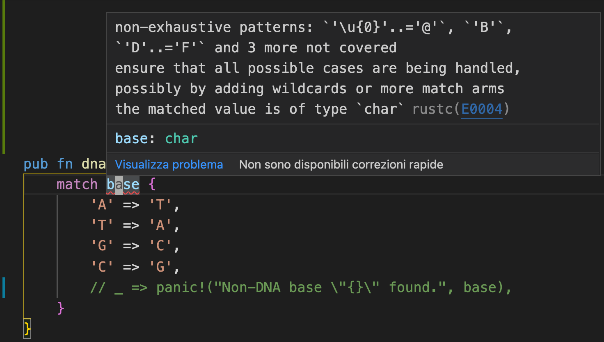
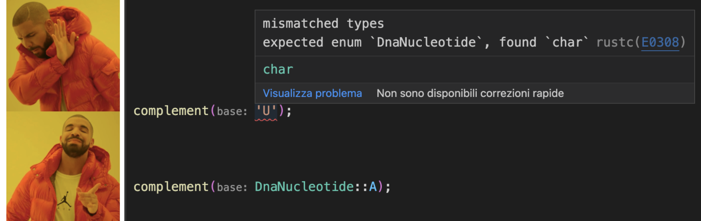
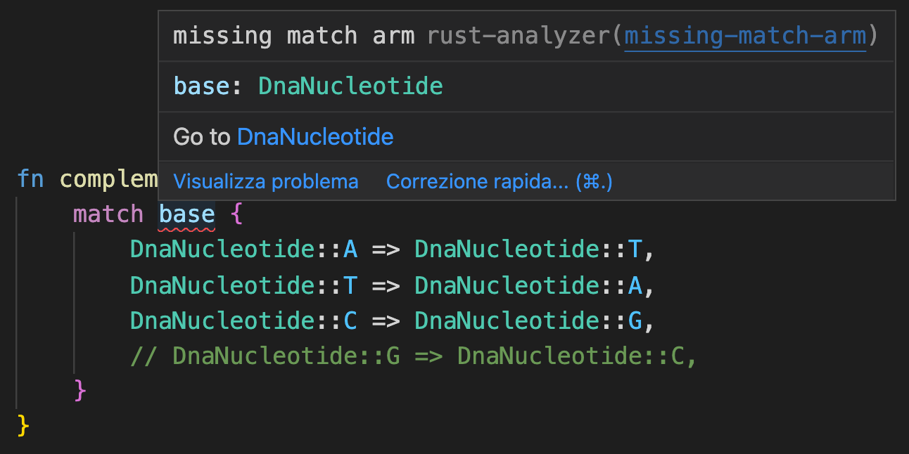
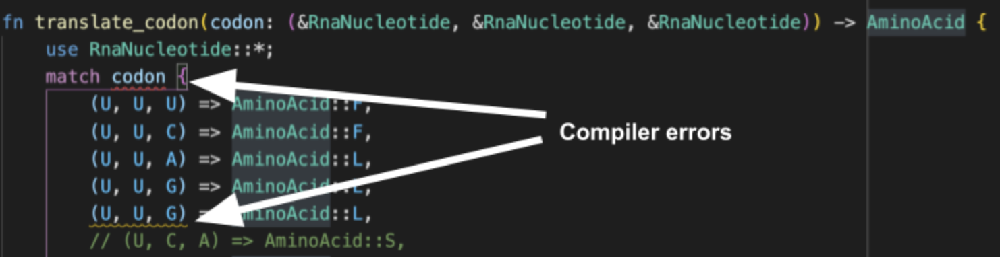

# Level 3: Using Algebraic Types in Rust
Note all the function names have types encoded in them so far, in both python and Rust. For example `trascribe_dna_to_rna`. Shouldn't this be encoded more like `translate(sequence: Dna) -> Rna`?

Using Rust's rich type system we can do this[^1]. Right now we operate on raw strings, which is inefficient because strings in Rust are encoded in Utf-8 (which is variable width, but still inefficient for an alphabet of only four symbols like DNA). And strings, since they are not a special purpose DNA type, don't let us take advantage of the type system. 

For example, the string version of the finding the base complement of some DNA

``` rust
pub fn dna_complement(base: char) -> char {
    match base {
        'A' => 'T',
        'T' => 'A',
        'G' => 'C',
        'C' => 'G',
        _ => panic!("Non-DNA base \"{}\" found.", base),
    }
}
```

Rust pattern matching does exhaustivity checking, so since ANY character can be passed in to this function, we have to also handle the case where the `base` argument is not one of four capital "ACTG". Otherwise if we comment out the last case the compiler will give us an error like so:



Great, so now if we somehow give a bad string to our function at runtime, the program will panic and crash. For example say we accidentally pass in an RNA string with "U"s in it, uh oohh! We want to check for these errors at compile time, and prevent the possibility of even wiring up `dna_base_complement` to something that passes it the wrong type. 

To do this we'll use algebraic data types. I'm not a theoretical expert on this, but bascally there are two algebraic data types: sum types and product types. Product types are just groups that can have more than one type in them. So tuples, structs, or python dataclasses. These are pretty obviously useful: sometimes you need to group diversely typed data about something into one type like a `user` that has a string `name` and int `age`. 

The other common algebraic type, sum types, were new to me, but I've realized they are perhaps more powerful and interesting. Sum types are just types that group together other types. In rust you create sum types with the `enum` keyword. It's kind of like inheritance, but weaker 

For example

``` rust
pub enum DnaNucleotide {
    A,
    C,
    G,
    T,
}
```

This defines `DnaNucleotide` as a new type that includes the types `A`, `C`, `G`, and `T`. Why is this interesting? Well now we can rewrite our function:

``` rust
fn complement(base: DnaNucleotide) -> DnaNucleotide {
    match base {
          DnaNucleotide::A => DnaNucleotide::T,
          DnaNucleotide::T => DnaNucleotide::A,
          DnaNucleotide::C => DnaNucleotide::G,
          DnaNucleotide::G => DnaNucleotide::C,
    }
}
```

First we can drop the `dna_` prefix from the function name: we know we are getting the complement of DNA because the `base` argument is of `DnaNucleotide` type, and so is the return type. It only accept DNA, not RNA or "Hello World!" or "为人民服务" or "🌯🍽️💨😬". If you try to pass a string in you get a compile time error



Also if we forget to handle one of the bases, we get a compile time error to really harness the power exhaustivity checking. 



This is even more useful when converting from codons to amino acids. If we forget or duplicate one of the 3^4 combinations, the compiler tell us!



Notce here I've made use of both `RnaNucleotide` and `AminoAcid` enums I've defined elsewhere in the cod

- https://www.youtube.com/watch?v=FnBPECrSC7o&ab_channel=JaneStreet
- enum are a bit tricky because they aren't types


# 4: Using lazy iterators
- can't use with python: https://depth-first.com/articles/2020/08/10/python-extensions-in-pure-rust-with-pyo3/
- They are fast, and should be even faster when chaining (like spark)
- https://github.com/mike-barber/rust-zero-cost-abstractions/blob/main/README.md
- The rust compiler error messages are often very good. First they tend to nicely try to point out where you went wrong by highlighing the code (I think python has finally decided this is a good idea too new pep?). Second, they tend to anticipate why every errors occured and offer possible solutions. For example mispelling. That said it's not always nice. For example chaining methods sometiems led to me attempting to return a local variable. 
- I stuggled a lot to get them to work. I basically ran into every problem listed in this post. https://depth-first.com/articles/2020/06/22/returning-rust-iterators/ With the sort of root cause that ?statically dispatched traits? can't quite be used like types (and I wanted to avoid dynamic dispatch if possible (though maybe it wasn't necessary?))
- ? is there an example optimiztion that might happen?
- at least demonstrate the power of `take` etc.
- read, transcribe, translate

# 5: Going multicore 
https://medium.com/@mjschillawski/quick-and-easy-parallelization-in-python-32cb9027e490
- dask
- rayon 

https://docs.google.com/spreadsheets/d/1-lrlYnfcRzlyVbfqHlM74Bpidv4auIxsR-fQR_o-oKo/edit#gid=0

# TODO:
Python Rust capitalized. RNA DNA built-in,comment all code blocks

- do iters seperately
- compare with bio python: https://biopython.org/wiki/Seq
- add rayon NOW just to see how easy it is (can't par replace in python)
- https://python.land/python-concurrency/python-multiprocessing


https://crates.io/crates/multiversion

---------------


[^1]: sort of exist in python but without the key piece of support: pattern matching
   https://stackoverflow.com/questions/16258553/how-can-i-define-algebraic-data-types-in-python

